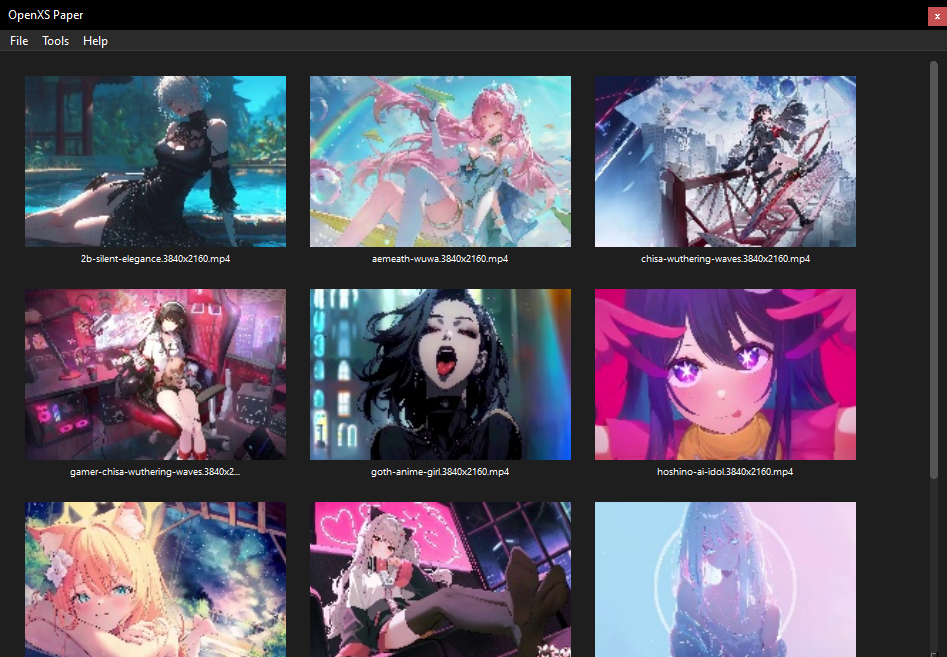
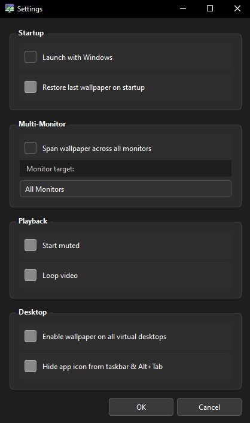

# OpenXS Paper

so basically this is a live wallpaper app i made with Python and PyQt6. you pick any video (mp4, mkv, avi, webm) and it plays on your desktop as the wallpaper. loops forever with no flicker or black frames between loops.

works on Windows fully. Linux and macOS can run the app but the desktop embedding part is windows only (more on that below).



---

## what it does

- plays video directly on the desktop layer, behind all your windows
- no flicker on loop — uses a double buffer trick so the transition is seamless
- shows a grid of all your wallpapers with thumbnails so you can pick one easily
- drag and drop videos or whole folders onto the window
- sits in the system tray when you close it, double click to bring it back
- remembers everything when you reopen it — last wallpaper, your whole dashboard, mute state etc
- settings popup for autostart with windows, monitor target, mute/loop defaults
- dark theme, looks clean

---

## what you need

| thing | version |
|---|---|
| Python | 3.12 or newer |
| PyQt6 | 6.7.1 |
| PyQt6-Qt6 | 6.7.1 |
| PyQt6-sip | 13.8.0 |
| opencv-python | 4.10.0.84 |

dont worry about installing these manually, the start scripts handle everything.

---

## how to run it

### Windows

just double click `start.bat` or run it from terminal:

```bat
start.bat
```

it will:
1. check if Python 3.12 is installed, if not it installs it via winget or chocolatey
2. create a `.venv` folder in the project
3. install all the pip stuff from requirements.txt
4. start the app

one liner if you have git:

```bat
git clone https://github.com/shirushimori/openxs-paper.git && cd openxs-paper && start.bat
```

### Linux / macOS

```bash
chmod +x start.sh && ./start.sh
```

same deal — checks for python 3.12, installs it if missing using whatever package manager you have:
- macOS → homebrew
- ubuntu/debian → apt (adds deadsnakes ppa for python 3.12)
- arch → pacman
- fedora → dnf
- opensuse → zypper

one liner:

```bash
git clone https://github.com/shirushimori/openxs-paper.git && cd openxs-paper && chmod +x start.sh && ./start.sh
```

### manual (if you want to do it yourself)

```bash
git clone https://github.com/shirushimori/openxs-paper.git
cd openxs-paper
python3.12 -m venv .venv

# windows
.venv\Scripts\pip install -r requirements.txt
.venv\Scripts\python main.py

# linux / macos
.venv/bin/pip install -r requirements.txt
.venv/bin/python main.py
```

---

## how to use it

| what you want to do | how |
|---|---|
| add a whole folder of wallpapers | File → Open Folder |
| add a single video | File → Add Video |
| set a wallpaper | just click the thumbnail |
| drag and drop | drop a video or folder anywhere on the window |
| zoom the grid | Ctrl + scroll up/down |
| mute / unmute | Tools → Mute / Unmute |
| toggle loop | Tools → Toggle Loop |
| open settings | File → Settings |
| minimize to tray | click the X button (doesnt close, goes to tray) |
| bring it back | double click the tray icon |
| actually quit | tray right click → Quit, or File → Exit |



---

## how it actually works

### desktop embedding (windows only)

windows has this hidden window called `WorkerW` that sits between the desktop icons and the actual wallpaper. `core/workerw.py` sends a message to `Progman` to make it appear, then uses `SetParent` to stick the video widget inside it. thats how the video ends up rendering as the real desktop background instead of just a window on top.

### the no-flicker loop trick

the obvious way to loop a video is to seek back to position 0 when it ends. problem is the media pipeline shows a black frame for a split second while it rebuffers. looks bad.

instead `core/wallpaper.py` runs two players (A and B) stacked on the same spot:

```
A is playing
B is already loaded and sitting at position 0, hidden underneath

A finishes → instantly raise B and play it (no loading needed, its ready)
            → A reloads in the background quietly

B finishes → instantly raise A and play it
           → B reloads in the background

and so on forever
```

because the next player is already buffered the swap is basically instant. no black frame, no stutter.

### thumbnails

`utils/file_utils.py` uses opencv to grab the first frame of each video and save it as a jpg in `assets/cache/`. next time you open the app it loads from cache so the dashboard appears fast even with lots of videos.

### settings are saved

everything goes into `config/settings.json` automatically:

```json
{
    "last_video": "Videos(Walpapers)/example.mp4",
    "last_folder": "Videos(Walpapers)",
    "dashboard_videos": ["Videos(Walpapers)/example.mp4"],
    "mute": false,
    "loop": true,
    "restore_on_startup": true,
    "multi_monitor": false,
    "monitor_target": "All Monitors"
}
```

this file is gitignored so your personal settings dont get pushed to the repo.

---

## project structure

```
openxs-paper/
├── main.py                  # starts the app, sets up dark theme and icon
├── requirements.txt         # pip packages
├── start.bat                # windows launcher
├── start.sh                 # linux/macos launcher
│
├── core/
│   ├── wallpaper.py         # the double buffer wallpaper engine
│   └── workerw.py           # finds the WorkerW window on windows
│
├── ui/
│   ├── main_window.py       # main window, grid, menus, zoom, drag drop
│   ├── thumbnail_widget.py  # each video card in the grid
│   ├── tray.py              # system tray icon and menu
│   └── settings_dialog.py  # settings popup
│
├── utils/
│   ├── config.py            # reads and writes settings.json
│   └── file_utils.py        # scans folders for videos, generates thumbnails
│
├── assets/
│   ├── cache/               # thumbnail jpgs go here (auto generated)
│   └── icons/
│       └── logo.ico         # app icon
│
└── config/
    └── settings.json        # your settings (created automatically, gitignored)
```

---

## platform notes

- **Windows** — everything works including the desktop embedding
- **Linux / macOS** — the app runs and you can use it as a video player UI, but the WorkerW desktop embedding is windows only so it wont set as your actual wallpaper. might add proper support for those platforms later.

---

## license

MIT — do whatever you want with it
